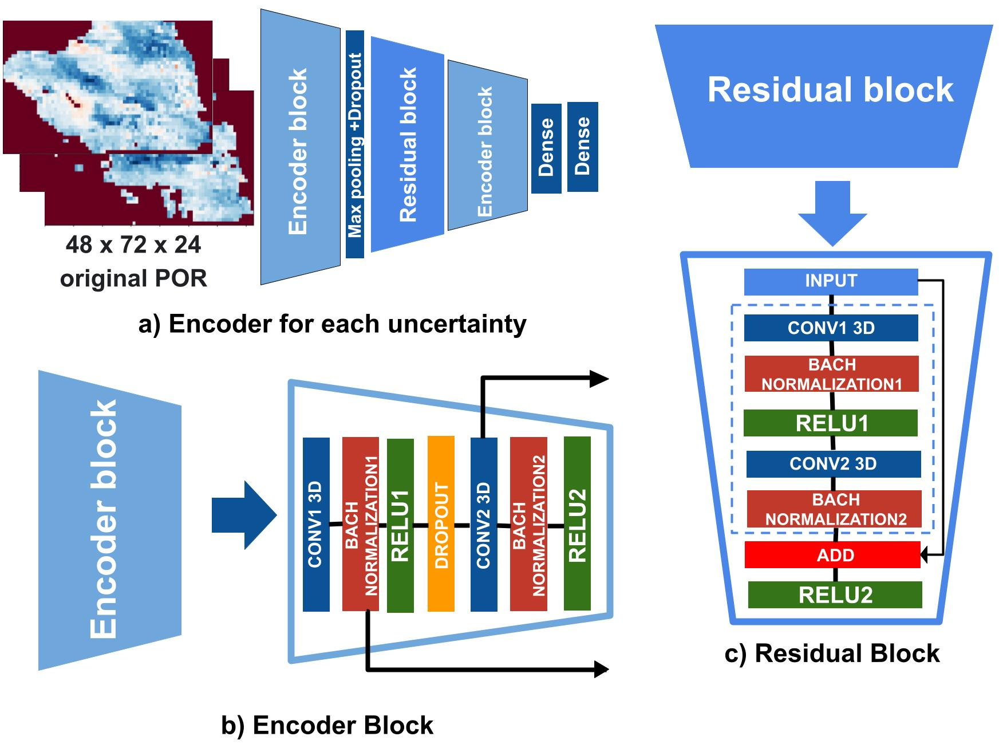
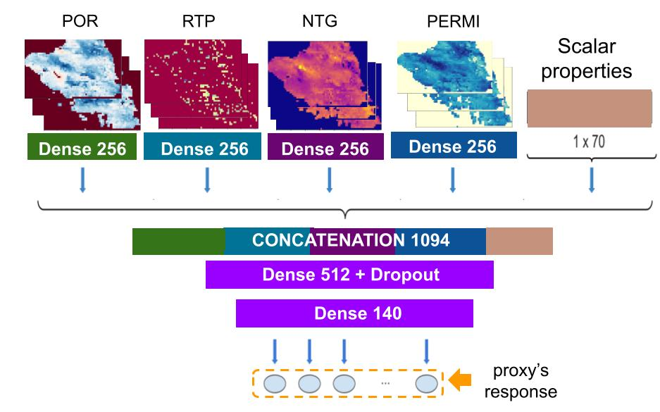
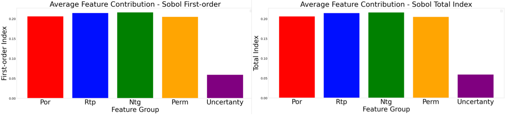

# End-to-end Dimensionality Reduction and Regression from 3D Geological Uncertainties to Estimate Oil Reservoir Simulations

This repo implements our paper End-to-end Dimensionality Reduction and Regression from 3D Geological Uncertainties to Estimate Oil Reservoir Simulations.

This repo explains dependencies, data preprocessing, training and testing for every module of our network:

## Dependencies
The implementation has been tested under a Mac OS environment with:
* Python (V3.7)
* Pandas (V2.0.3)
* Sklearn (V1.3.0)
* Scipy (V1.9.1)
* Matplotlib (V3.7.2)
* Seaborn (V0.12.2)
* Gpustat (V1.1)
* keras_application (V.0.8)
* OpenCV (V4.5.1)
* Tensorflow (V2.12.0)
* Numpy (V1.23.0)

Other library versions and operating systems may require minor adjustments.

## Preprocessing

To preprocess the data, we utilize a single script: `src/preprocessing.py`. This script accepts five parameters:

1. **pathToUncertainties**: This parameter denotes the path where the 1D and 3D uncertainties are stored. There are two types of shapes for uncertainties:
   - For 3D uncertainties: The shape is (N, 24, 38, 73, 1), where:
     - N corresponds to the number of uncertainties.
     - 24 corresponds to the number of channels.
     - 38 corresponds to the number of heights.
     - 73 corresponds to the number of weights.
     - 1 corresponds to another dimension.
   - For 1D uncertainties: The shape is (N, 70), where N represents the number of 1D fluid properties.

2. **pathToObjectiveFunction**: This parameter signifies the path where the complete objective functions are stored.

3. **pathToObserved**: This parameter indicates the path where the observed data is saved.

4. **pathToSaveOutput**: This parameter specifies the path where the resulting objective functions will be saved

5. **isSomeDays**: This parameter offers the option to choose between 2206 days or 5 days for the cumulative curve, you can set `--isSomeDays 'someDays', 'allDays'`.


You can run the preprocessing script with the following command:

```bash
python preprocessing.py pathToUncertainties pathToObjectiveFunction pathToObserved pathToSaveOutput isSomeDays
```

## Train, Test, and AI Explainability

To facilitate training, testing, and generating AI explainability, we provide a comprehensive notebook: `proxy_build.ipynb`. Simply execute all cells within this notebook.

This notebook integrates training, testing, correlation, curve visualization, and AI explainability.

The main function, `pretrained`, requires nine parameters:

1. **uncertainties_path**: Path where normalized uncertainties are stored.

2. **production_path**: Path where cumulative curves are saved.

3. **history_path**: Path where historical data is stored.

4. **days_txt**: Path to the file containing the selected five days to represent each cumulative curve.

5. **gpu_id**: To utilize multiple GPUs, specify `--gpu_id 0,1,2,3`.

6. **is_some_days**: Option to choose between 2206 days or 5 days for the cumulative curve, you can set `--is_some_days 'someDays', 'allDays'`.

7. **results_path**: Path containing visualization results of the cumulative curves.

8. **ann**: Option to choose between implementing previous work or our proposed proxy, you can set `--ann 'ANN', 'proxy', 'meda'`.

9. **optimize_analysis**: Option to determine whether AI explainability will be applied, you can set `--optimize_analysis 'True', 'False'`.

```bash
    problem, y_test_sobol, x_test_encoder, new_model = pretrained(uncertainties_path,
                                                                  production_path,
                                                                  history_path,
                                                                  days_txt,
                                                                  gpu_id,
                                                                  is_some_days,
                                                                  results_path,
                                                                  ann,
                                                                  optimize_analysis)
```

Each 3D geological uncertainty, with dimensions of 72 * 48 * 24 is subsequently fed into our module dedicated to dimensionality reduction. This specialized module undertakes dimensionality reduction for each geological realization. The representation vector of the input image is obtained through different hierarchical levels using distinct layers within the 3D block encoders, 3D max-pooling, and a 3D residual block, as illustrated in the follow figure.



In the follow figure you can see our end-to-end solution that employ the dimensionally reduced properties to conduct regression via the utilization of Dense layers.



The follow figure represents the results of Sobol's analysis. The first image shows the first-order, while the second shows the total index. Both indicate the average contribution of five groups of characteristics - Porosity (Por), Rock Type (Rtp), Net to Gross (Ntg), Permeability (Perm), and Fluid properties - to the variance in the output of our methodology.



## Results
Results of a comparative evaluation of our end-to-end 3D CNN with state-of-the-art methods focusing on oil and water-related objective functions are presented in the follow table
| Work                                     | Oil (SMAPE) | Oil (R) | Oil ($R^2$) | Water (SMAPE) | Water (R) | Water ($R^2$) |
|---------------------------------------------------|----------------------|------------------|----------------------|------------------------|---------------------|------------------------|
| end-to-end 3D CNN                                | **3.413**            | **0.970**        | 0.939                | **19.437**             | **0.954**           | **0.907**              |
| Maschio *et al.* [1]                             | 5.370                | 0.929            | 0.847                | 27.458                 | 0.907               | 0.798                  |
| Sudakov *et al.* [2]                             | 3.615                | 0.963            | **0.963**            | 19.648                 | 0.946               | 0.890                  |
| Ma *et al.* [3]                                  | 4.167                | 0.959            | 0.907                | 22.711                 | 0.936               | 0.857                  |
| Kolajoobi *et al.* [4]                           | 4.980                | 0.940            | 0.882                | 26.945                 | 0.919               | 0.843                  |

Results of a comparative evaluation of our end-to-end 3D CNN with state-of-the-art methods focusing on gas and bhp-related objective functions are presented in the follow table
| Work                                     | Gas (SMAPE) | Gas (R) | Gas ($R^2$) | Pressure (SMAPE) | Pressure (R) | Pressure ($R^2$) |
|---------------------------------------------------|-----------------------|------------------|-----------------------|----------------------------|------------------------|--------------------------|
| end-to-end 3D CNN                                | **3.461**             | **0.969**        | **0.939**             | **1.055**                  | **0.880**              | **0.765**                |
| Maschio *et al.* [1]                             | 5.357                 | 0.930            | 0.864                 | 1.562                      | 0.791                  | 0.538                    |
| Sudakov *et al.* [2]                             | 3.622                 | 0.964            | 0.930                 | 1.136                      | 0.858                  | 0.727                    |
| Ma *et al.* [3]                                  | 4.128                 | 0.960            | 0.910                 | 1.257                      | 0.842                  | 0.680                    |
| Kolajoobi *et al.* [4]                           | 4.995                 | 0.940            | 0.882                 | 1.401                      | 0.801                  | 0.611                    |

Results of a comparative evaluation of the time performance of our end-to-end 3D CNN compared to state-of-the-art methods. This evaluation focuses on computing time for tasks such as uploading files, normalization, training, and predicting the replicated simulator responses across various combinations of training samples: 50, 100, and 140 are presented in the follow table
| Work                                    | 50 | 100 | 140 |
|---------------------------------------------------|-------------|--------------|--------------|
| end-to-end 3D CNN                                | **6:36**    | **6:41**     | **6:46**     |
| Maschio *et al.* [1]                             | 13:53       | 30:13        | 34:53        |
| Sudakov *et al.* [2]                             | 01:08:58    | 01:15:55     | 01:48:09     |
| Ma *et al.* [3]                                  | 02:29:13    | 06:32:05     | 07:18:45     |
| Kolajoobi *et al.* [4]                           | 7:21        | 8:17         | 9:13         |

## Acknowledgment
This work was conducted with the support of Energi Simulation and in association with the ongoing Project registered under ANP number 21870-1 as "Desenvolvimento de uma Abordagem para Construção de Modelos Multifidelidades para Reduzir Incertezas e Melhorar Previsão de Produção" (UNICAMP/Shell Brazil/ANP) funded by Shell Brazil, under the ANP R&D levy as "Compromisso de Investimentos com Pesquisa e Desenvolvimento". The authors thank also UNISIM, DE-FEM-UNICAMP, Recod.ai, IC-UNICAMP, and CEPETRO for supporting this work. We also thank CMG, Emerson, and Schlumberger for software licenses.

## References
[1] [Maschio *et al.* Data Assimilation Using Principal Component Analysis and Artificial Neural Network](https://onepetro.org/REE/article-abstract/26/03/795/519019/Data-Assimilation-Using-Principal-Component?redirectedFrom=fulltext) <br />
[2] [Sudakov *et al.* Artificial neural network surrogate modeling of oil reservoir: a case study](https://arxiv.org/abs/1905.07859) <br />
[3] [Ma *et al.* A novel hybrid recurrent convolutional network for surrogate modeling of history matching and uncertainty quantification](https://www.sciencedirect.com/science/article/pii/S0920410522000067)<br />
[4] [Kolajoobi *et al.* Investigating the capability of data-driven proxy models as solution for reservoir geological uncertainty quantification](https://www.sciencedirect.com/science/article/pii/S0920410521005210) <br />
